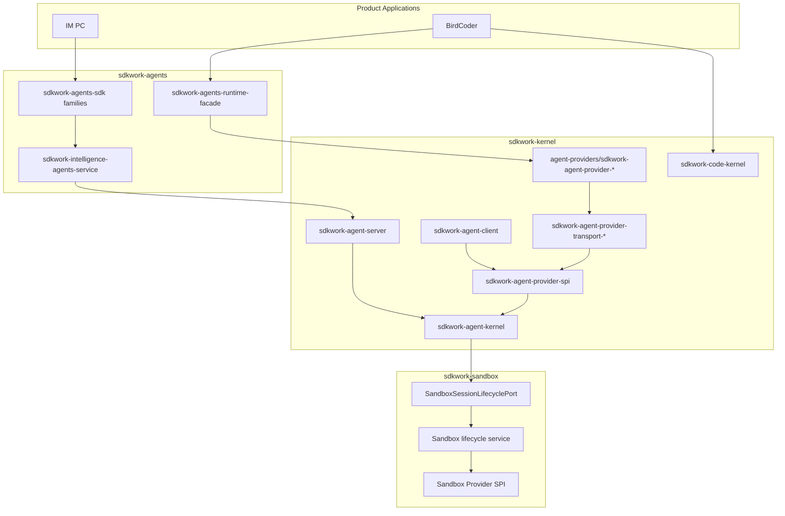

# SDKWork Kernel Technical Architecture

Status: active
Owner: SDKWork kernel maintainers
Updated: 2026-07-28
Specs: [ARCHITECTURE_DECISION_SPEC.md](../../../sdkwork-specs/ARCHITECTURE_DECISION_SPEC.md), [DOCUMENTATION_SPEC.md](../../../sdkwork-specs/DOCUMENTATION_SPEC.md), [RUST_CODE_SPEC.md](../../../sdkwork-specs/RUST_CODE_SPEC.md), [INTERNAL_API_SPEC.md](../../../sdkwork-specs/INTERNAL_API_SPEC.md), [SECURITY_SPEC.md](../../../sdkwork-specs/SECURITY_SPEC.md), [HEALTH_CHECK_SPEC.md](../../../sdkwork-specs/HEALTH_CHECK_SPEC.md), [DEPLOYMENT_SPEC.md](../../../sdkwork-specs/DEPLOYMENT_SPEC.md)

## Document Map

### As-built authority

| Shard | Topic |
| --- | --- |
| [TECH-01-kernel-module-reference.md](TECH-01-kernel-module-reference.md) | Crate reference, entrypoints, env vars, bootstrap sequence |
| [TECH-02-provider-framework-matrix.md](TECH-02-provider-framework-matrix.md) | Framework capability matrix (Codex, Claude Code, Gemini CLI, OpenCode, MiMo Code, OpenClaw, Hermes, Rig) |
| [TECH-03-spi-implementation-gap-tracker.md](TECH-03-spi-implementation-gap-tracker.md) | SPI gaps, commercial scorecard, cross-repo alignment |
| [TECH-2026-06-14-multi-mode-agent-system.md](TECH-2026-06-14-multi-mode-agent-system.md) | Server plugins, client bridge, provider crates |
| [TECH-2026-06-10-agent-execution-loop.md](TECH-2026-06-10-agent-execution-loop.md) | Turn loop, planning, tool execution |
| [TECH-2026-06-10-sdkwork-kernel-plugin-system.md](TECH-2026-06-10-sdkwork-kernel-plugin-system.md) | Kernel plugin manifests and contribution |
| [TECH-2026-06-12-agent-implementation-type.md](TECH-2026-06-12-agent-implementation-type.md) | Implementation typing and registry |
| [TECH-topology-standard.md](TECH-topology-standard.md) | Deployment topology profiles |
| [specs/AGENT_PROVIDER_INTEGRATION_SPEC.md](../../../specs/AGENT_PROVIDER_INTEGRATION_SPEC.md) | Provider integration normative spec |

### Design history and alignment

| Shard | Topic |
| --- | --- |
| [TECH-2026-06-04-external-agent-plugins.md](TECH-2026-06-04-external-agent-plugins.md) | Early external plugin exploration |
| [TECH-2026-06-04-rig-complete-plugin-design.md](TECH-2026-06-04-rig-complete-plugin-design.md) | Rig plugin design draft |
| [TECH-2026-06-10-agent-execution-loop-design.md](TECH-2026-06-10-agent-execution-loop-design.md) | Execution loop design draft |
| [TECH-2026-06-10-sdkwork-kernel-plugin-system-design.md](TECH-2026-06-10-sdkwork-kernel-plugin-system-design.md) | Plugin system design draft |
| [TECH-2026-06-12-sdkwork-specs-structure-hardening.md](TECH-2026-06-12-sdkwork-specs-structure-hardening.md) | Standards structure hardening summary |
| [TECH-2026-06-12-sdkwork-specs-structure-hardening-design.md](TECH-2026-06-12-sdkwork-specs-structure-hardening-design.md) | Standards structure hardening design |
| [TECH-sdkwork-standards-alignment-20260612.md](TECH-sdkwork-standards-alignment-20260612.md) | Standards alignment evidence |

### Superseded (pointer only — do not implement)

- [TECH-2026-06-04-rig-agent-provider-deployments.md](TECH-2026-06-04-rig-agent-provider-deployments.md)
- [TECH-2026-06-04-rig-complete-plugin.md](TECH-2026-06-04-rig-complete-plugin.md)
- [TECH-2026-06-14-multi-mode-agent-system-design.md](TECH-2026-06-14-multi-mode-agent-system-design.md)
- [../desktop-server-architecture.md](../desktop-server-architecture.md) (redirect)
- [../archive/architecture/desktop-server-architecture.md](../archive/architecture/desktop-server-architecture.md)

## 1. Architecture Overview

SDKWork Kernel is a **Rust-first intelligence platform** that provides mechanism-layer
capabilities for agent and code-agent systems. It follows a Linux-kernel-style split:

- **Kernel** (`sdkwork-kernel`) — runtime SPI, provider integration, transport,
  operational server, internal API, client bridge, code kernel.
- **Application** (`sdkwork-agents`) — managed agents, marketplace, product HTTP/SDK.
- **Execution environment** (`sdkwork-sandbox`) — `SandboxSession` lifecycle,
  `SandboxRuntimeBinding`, Workspace Attachment and Sandbox Provider SPI.
- **Products** (BirdCoder, IM PC) — consume agents application surfaces; must not
  depend on `sdkwork-agent-provider-*` directly.

`Agent Provider` means the model/agent-engine integration owned by Kernel.
`Sandbox Provider` means the execution-environment implementation owned by
Sandbox. The two Provider families are independent contracts and must not be
used interchangeably.



### Layering model

| Layer | Crate family | Responsibility |
| --- | --- | --- |
| L0 | `sdkwork-agent-kernel` | Model, tool, skill, session, policy, memory, knowledge, planning, host, protocol, MCP, collaboration, telemetry, task scheduling, agent classification, message query semantics |
| L1 | `sdkwork-agent-provider-spi` | Capability drivers, binding negotiation, transport selection |
| L2 | `sdkwork-agent-provider-transport-*` | Language/runtime transport hosts and workers |
| L3 | `sdkwork-agent-provider-{name}` | Per-framework manifest wiring, bootstrap, adapters |
| L4 | `sdkwork-agents` | Application domain, HTTP routes, SDK families, runtime facade |
| L5 | Product apps | BirdCoder, IM PC, future surfaces |

Within the Kernel Agent Provider framework, dependencies point inward toward L0
and products never skip L4 to reach L3. Across repository ownership boundaries,
the authoritative direction is
`sdkwork-agents -> sdkwork-kernel -> sdkwork-sandbox`; Sandbox does not depend
back on Kernel or Agents.

## 2. Technology Choices

| Concern | Choice | Governing spec |
| --- | --- | --- |
| Primary language | Rust 2021 | [RUST_CODE_SPEC.md](../../../sdkwork-specs/RUST_CODE_SPEC.md) |
| HTTP server | Axum 0.8 via `sdkwork-web-axum` | [WEB_FRAMEWORK_SPEC.md](../../../sdkwork-specs/WEB_FRAMEWORK_SPEC.md) |
| Persistence | SQLx (Postgres/SQLite) | [DATABASE_SPEC.md](../../../sdkwork-specs/DATABASE_SPEC.md) |
| Node transport | Bun/Node worker subprocess | [AGENT_PROVIDER_INTEGRATION_SPEC.md](../../../specs/AGENT_PROVIDER_INTEGRATION_SPEC.md) |
| Python transport | Subprocess + JSON-RPC | [AGENT_PROVIDER_INTEGRATION_SPEC.md](../../../specs/AGENT_PROVIDER_INTEGRATION_SPEC.md) |
| Contract authority | OpenAPI + JSON schemas | [INTERNAL_API_SPEC.md](../../../sdkwork-specs/INTERNAL_API_SPEC.md) |
| Generated SDK | `sdkwork-agent-internal-sdk` | [SDK_SPEC.md](../../../sdkwork-specs/SDK_SPEC.md) |
| Topology | Env profiles | [APP_RUNTIME_TOPOLOGY_SPEC.md](../../../sdkwork-specs/APP_RUNTIME_TOPOLOGY_SPEC.md) |
| Package orchestration | pnpm + Cargo workspace | [PNPM_SCRIPT_SPEC.md](../../../sdkwork-specs/PNPM_SCRIPT_SPEC.md) |

## 3. System Boundaries And Modules

| Area | Primary crates | Detail shard |
| --- | --- | --- |
| Agent runtime core | `sdkwork-agent-kernel`, `sdkwork-agent-session`, `sdkwork-agent-database`, `sdkwork-agent-api-bridge` | [TECH-01-kernel-module-reference.md](TECH-01-kernel-module-reference.md) |
| Provider integration | `sdkwork-agent-provider-spi`, `sdkwork-agent-provider-transport-*`, `agent-providers/crates/sdkwork-agent-provider-*` | [TECH-2026-06-14-multi-mode-agent-system.md](TECH-2026-06-14-multi-mode-agent-system.md) |
| Server and client | `sdkwork-agent-server`, `sdkwork-agent-client`, `sdkwork-routes-agent-internal-*` | [TECH-01-kernel-module-reference.md](TECH-01-kernel-module-reference.md) |
| Code kernel | `sdkwork-code-kernel` | [specs/CODE_KERNEL_SPEC.md](../../../specs/CODE_KERNEL_SPEC.md) |
| Platform plugins | `sdkwork-agent-plugin-core`, Drive, knowledgebase plugins | [TECH-2026-06-10-sdkwork-kernel-plugin-system.md](TECH-2026-06-10-sdkwork-kernel-plugin-system.md) |
| Sandbox lifecycle adaptation | `sdkwork_agent_kernel::sandbox_runtime` consuming `SandboxSessionLifecyclePort` | [specs/AGENT_KERNEL_SPEC.md](../../../specs/AGENT_KERNEL_SPEC.md) |

## 4. Directory And Package Layout

```text
sdkwork-kernel/
  sdkwork-agent-kernel/           # L0 agent SPI
  sdkwork-code-kernel/            # Code-agent SPI
  sdkwork-agent-provider-spi/     # L1 provider integration SPI
  sdkwork-agent-provider-transport-*/  # L2 transports
  agent-providers/
    crates/sdkwork-agent-provider-{framework}/  # L3 implementations
  bindings/agent-providers/
    {framework}/provider-binding.manifest.json
  sdkwork-agent-server/           # Operational HTTP server
  sdkwork-agent-client/           # Desktop/mobile bridge client
  sdkwork-kernel-plugins/         # Plugin trait + provider-core + platform plugins
  apis/internal-api/              # Internal runtime OpenAPI authority
  sdks/sdkwork-agent-internal-sdk/
  specs/                          # Normative kernel specs
  etc/topology/               # Deployment env profiles
  scripts/
    check-agent-provider-bindings.mjs
    provider-transport-workers/   # Node/Python SDK workers
  external/                       # Pinned read-only upstream source inputs (submodules)
```

Root layout authority: [SDKWORK_WORKSPACE_SPEC.md](../../../sdkwork-specs/SDKWORK_WORKSPACE_SPEC.md).

### External source dependency boundary

Provider-neutral L0/L1 contracts and L2 transports do not depend on upstream
source trees. An owning L3 provider may compile an approved public upstream
facade from a pinned, read-only `external/` submodule through root Cargo
workspace dependencies. Provider-specific types terminate at L3 adapters and
must not appear in Kernel-neutral SPI or internal HTTP contracts.

Codex uses this source-integration path for the official in-process
`codex-app-server-client` and `codex-app-server-protocol`. Thread, Turn,
ThreadItem, status, and opaque cursor data flow through typed requests. Kernel
does not resolve or open Codex private state files by path, query their schema,
or parse rollout files. The L3 host uses the official Codex state-bootstrap API
required by the in-process app-server. See
[TECH-2026-08-01-codex-source-integration.md](TECH-2026-08-01-codex-source-integration.md).

## 5. API, SDK, And Data Ownership

### HTTP surfaces

| Surface | Owner | Path prefix |
| --- | --- | --- |
| Internal runtime API | `sdkwork-kernel` | `/internal/v3/api/intelligence/runtime` |
| Agents open API | `sdkwork-agents` | `/agent/v3/api` |
| Agents app API | `sdkwork-agents` | `/app/v3/api` |
| Agents backend API | `sdkwork-agents` | `/backend/v3/api` |

Agents owns `AgentWorkspace` and `AgentSession`. Kernel validates and maps their
authorized identifiers into `SandboxWorkspaceId` and `SandboxSessionId`, invokes
the Sandbox-owned lifecycle port, and maps `SandboxRuntimeBindingId` back to the
opaque Agents `runtimeLocationId`. Kernel does not expose
`SandboxProviderAllocationRef`, infer a host path from `sandbox_workspace_id`,
or persist a second Workspace/Session business aggregate.

Kernel-to-Sandbox fields and variables use `sandbox_` prefixes, including
`sandbox_workspace_id`, `sandbox_session_id`, `sandbox_operation_id` and
`sandbox_runtime_binding_id`. Agents HTTP fields such as `workspaceId`,
`sessionId` and `runtimeLocationId` remain Agents-owned public contract names.

Retired application-local prefixes such as `/api/kernel/*` must not be remounted.

#### Internal runtime API endpoints

The internal runtime API (`/internal/v3/api/intelligence/runtime/*`) exposes the
following operation groups. The authoritative OpenAPI contract lives at
`apis/internal-api/intelligence/sdkwork-agent-internal-api.openapi.yaml`; the
TypeScript SDK is regenerated via `node sdks/workspace-agent-sdkgen.mjs --mode apply`.

| Operation | Method | Path | Aligns with |
| --- | --- | --- | --- |
| `runtime.manifest.get` | GET | `/manifest` | `AGENT_RUNTIME_SPEC` §4 `get_runtime_manifest` / `get_capability_manifest` |
| `runtime.health.get` | GET | `/health` | `AGENT_RUNTIME_SPEC` §4 `get_health` |
| `runtime.diagnostics.get` | GET | `/diagnostics` | `AGENT_RUNTIME_SPEC` §4.1 `get_diagnostics` |
| `runtime.snapshot.load` | GET | `/snapshot` | UI aggregate snapshot |
| `runtime.permissions.decide` | POST | `/permissions/{permissionRequestId}` | `respond_to_permission` |
| `runtime.sessions.create/list` | POST/GET | `/sessions` | `create_session` / `list_sessions` |
| `runtime.sessions.retrieve/delete` | GET/DELETE | `/sessions/{sessionId}` | `get_session` / delete |
| `runtime.sessions.close` | POST | `/sessions/{sessionId}/close` | `close_session` |
| `runtime.sessions.messages.send/list` | POST/GET | `/sessions/{sessionId}/messages` | `send_message` returns a completed `MessageTurnResponse`; list uses cursor-only keyset paging |
| `runtime.sessions.tasks.submit/list` | POST/GET | `/sessions/{sessionId}/tasks` | `create_task` (POST) / `list_tasks` (GET) on the same path |
| `runtime.tasks.retrieve` | GET | `/tasks/{taskId}` | `get_task` |
| `runtime.tasks.cancel` | POST | `/tasks/{taskId}/cancel` | `cancel_task` |
| `runtime.models.list` | GET | `/models` | model catalog |
| `runtime.sessions.model.invoke` | POST | `/sessions/{sessionId}/model/invoke` | model chat |
| `runtime.sessions.tools.list` | GET | `/sessions/{sessionId}/tools` | tool discovery |
| `runtime.sessions.tools.execute` | POST | `/sessions/{sessionId}/tools/{toolName}/execute` | `tool.invoke` |
| `runtime.sessions.events.stream` | GET (SSE) | `/sessions/{sessionId}/events/stream` | `subscribe_events` |

The `/manifest`, `/health`, and `/diagnostics` internal runtime endpoints are
side-effect-free and suitable for UI clients, CI gates, and conformance runners.
The infrastructure probes used by load balancers and orchestrators are
`/healthz`, `/readyz`, and `/livez`; they intentionally return minimal probe
bodies. Internal runtime `/health` combines runtime state with persistence
health and may return `503` with `application/problem+json` when degraded.

`POST /sessions/{sessionId}/messages` returns `201 Created` with the standard
`SdkWorkApiResponse.data.item` envelope. Its item contains required
`userMessage`, optional `assistantMessage`, and `status: "completed"`, so SDK
consumers receive the completed persisted turn instead of only the submitted
user message.

### SDK families

| SDK | Owner | Consumers |
| --- | --- | --- |
| `sdkwork-agent-internal-sdk` | Kernel | Server, agents kernel-bridge, privileged clients |
| `sdkwork-agents-sdk` | Agents application | Product apps, consoles |

### Data stores

| Store | Owner | Env prefix |
| --- | --- | --- |
| Runtime session DB | Kernel server | `SDKWORK_DATABASE_*` workspace PostgreSQL |
| Client local sessions | Kernel client | `SDKWORK_DATABASE_FILE` |
| Managed agents store | Agents app | `SDKWORK_DATABASE_*` workspace PostgreSQL |

Provider binding negotiation, bootstrap flow, and transport priority are documented in
[TECH-01-kernel-module-reference.md §4–5](TECH-01-kernel-module-reference.md#4-provider-bootstrap-sequence).

Provider binding manifests define both selection and execution. Capabilities
declare `execution_scope`, and selected backends declare `runtime_operations`.
Provider-local lifecycle capabilities such as `sdk.session.lifecycle` and
`sdk.session.history` use provider-core/local SPI state and expose only
`runtime_operations: ["ping"]` through runtime routing. Transport-backed model,
stream, tool, and skill operations require `execution_scope: transport_runtime`
and are rejected before worker invocation when the requested operation is absent
from the selected backend allowlist.

### Agent kernel SPI provider families

The `sdkwork-agent-kernel` crate defines **18 core** and **6 extension** provider
families (see `AGENT_KERNEL_SPEC.md` §3.4). Each core family is registered through
`RuntimeBuilder` and resolved at runtime via `AgentRuntime` accessor methods. The
`RuntimeProviderRegistry` maintains both a primary (first-registered) provider and
a multi-provider list for each family, enabling provider-by-id lookup and
multi-provider fan-out.

| Provider family | SPI trait | Capability IDs | Side-effect profile |
| --- | --- | --- | --- |
| `model` | `ModelProvider` | `model.chat`, `model.catalog`, `model.reasoning`, `model.tool_call`, `model.structured_output`, `model.streaming`, `model.embedding`, `model.cancellation` | External send |
| `tool` | `ToolProvider` | `tool.invoke`, `tool.discovery`, `tool.streaming`, `tool.cancellation` | Side-effectful |
| `policy` | `PolicyProvider` | `policy.evaluate` | Read-only |
| `context` | `ContextProvider` | `context.collect` | Read-only |
| `memory` | `MemoryProvider` | `memory.query`, `memory.write`, `memory.delete`, `memory.export` | Read / Side-effectful / Destructive |
| `knowledge` | `KnowledgeProvider` | `knowledge.search`, `knowledge.read`, `knowledge.list` | Read-only |
| `planning` | `PlanningProvider` | `planning.create` | Read-only |
| `host` | `HostProvider` | `host.filesystem`, `host.process`, `host.network`, `host.secrets` | Read / Side-effectful |
| `protocol_adapter` | `ProtocolAdapter` | `protocol.map`, `protocol.stream` | Read-only |
| `mcp` | `McpProvider` | `mcp.tools`, `mcp.resources`, `mcp.prompts` | Side-effectful / Read-only |
| `skill` | `AgentSkillProvider` | `skill.discover`, `skill.invoke` | Read-only / Side-effectful |
| `collaboration` | `AgentCollaborationProvider` | `agent.discover`, `agent.handoff`, `agent.delegate` | Read-only / External send |
| `telemetry` | `TelemetryProvider` | `telemetry.record` | Side-effectful |
| `task_scheduling` | `TaskSchedulingProvider` | `task.schedule`, `task.cancel`, `task.list`, `task.pause`, `task.resume`, `task.get_due` | Side-effectful / Read-only |
| `agent_classification` | `AgentClassificationProvider` | `agent.classify`, `agent.classification.get`, `agent.classification.list`, `agent.classification.search` | Read-only |
| `message_query` | `MessageQueryProvider` | `message.query`, `message.count`, `message.list_sessions`, `message.search` | Read-only |
| `agent_installer` | `AgentInstaller` | `agent.install`, `agent.uninstall`, `agent.upgrade` | Side-effectful / Destructive |
| `agent_configuration` | `AgentConfigurationProvider` | `agent.configure` | Side-effectful |

Extension families (see `AGENT_KERNEL_SPEC.md` §3.4): `sandbox`, `secret`,
`rate_limit`, `cancellation`, `model_stream`, `backend_health`. Orchestration
primitives and A2A adapters are specified in `MULTI_AGENT_ORCHESTRATION_SPEC.md`
and `A2A_PROTOCOL_ADAPTER_SPEC.md`.

Each capability ID maps to `CapabilityMetadata` (operations, `SideEffectLevel`,
`PolicyCategory`) via the `capability_metadata` function, enabling the policy
layer to enforce fail-closed security decisions based on the side-effect
classification of each operation.

## 6. Security, Privacy, And Observability

### Fail-closed production posture

- `sdkwork-agent-provider-core::mock_policy` gates mock model/tool responses.
- `SDKWORK_KERNEL_ALLOW_MOCK_PROVIDERS=1` is development-only, and the kernel
  gate itself (`mock_provider_invocation_allowed`) rejects it unconditionally
  in production profiles, so embedded runtimes without a server preflight in
  front cannot be flipped into mock responses by environment variable.
- Model and tool catalogs are fail-closed: a missing or empty production
  provider reports no models instead of surfacing the phantom mock catalog,
  and the mock fallback is reachable only through explicit test construction.
- Permission-hook approvals substitute for the interactive human approval
  only; the policy provider still evaluates every hook-approved tool call
  (fail-closed), and an explicit policy Deny wins over a hook Approve.
- Transport `prepare()` health determines router attachment.
- SDK workers reject fail-open invoke paths when spawn or negotiation fails.
- Backend selection treats an unknown driver health probe (registered but
  never probed) as unhealthy rather than healthy.
- **Rate limiter**: Multi-replica production uses Redis-backed enforcement and
  denies requests when Redis fails. Bounded in-process buckets are limited to
  non-distributed profiles; they are not a production cluster fallback.
- **Tenant token quota**: Uses an atomic **reserve-and-adjust** pattern
  (Redis Lua script) to eliminate the TOCTOU race between quota check and
  usage recording. Reservation is capped by the tenant's configured daily
  limit, and the adjustment phase uses the same reserved amount so small
  quotas cannot drive Redis counters negative. When Redis is unavailable and
  the tenant has a configured quota, requests are rejected with 503 (Service
  Unavailable) to prevent billing abuse during outages.
- **JWKS URL**: Enforced HTTPS in production at both the preflight check
  and the runtime refresh path to prevent MITM key replacement. JWKS refresh
  (file I/O and HTTP fetch) is offloaded to `spawn_blocking` to avoid
  blocking the async runtime.
- **Token fingerprint**: Rate-limit keys for unauthenticated clients use
  SHA-256 (via `sdkwork-utils-rust`) instead of `DefaultHasher`, ensuring
  stable, platform-independent fingerprints.
- **Metrics/Ingress token separation**: Metrics auth never falls back to the
  ingress token. Production preflight fails when the dedicated metrics token
  is missing, and deployment policy requires separate credentials.
- **Security headers**: CSP, HSTS, `X-Content-Type-Options`,
  `X-Frame-Options`, `Referrer-Policy`, and `Permissions-Policy` are set
  on every response.
- **RFC 9457 Problem Details**: All middleware-layer error responses
  (auth failures, rate limiting, identity resolution) return structured
  `application/problem+json` bodies with `type`, `title`, `status`, numeric
  `code`, and `traceId` for machine-readable error handling.
- **PostgreSQL authority guard**: server configuration rejects SQLite before
  startup. SQLite is limited to declared client-local stores and test fixtures
  (the server exposes a `sqlite` feature for those fixture paths only).
- **Cancel model parity**: the default rig provider registers its in-flight
  model calls so `/sessions/{sessionId}/model/cancel` aborts the spawned
  provider task and the blocked invoke returns a cancelled response, instead
  of acknowledging cancellation while the call continued to completion.

### Ingress and client auth

- Server: `SDKWORK_KERNEL_INGRESS_AUTH_MODE` via `sdkwork-agent-server`.
- Client remote mode: `sdkwork-agent-client/src/ingress_auth.rs` aligned with server.
- Locally generated request, session, and message IDs use random UUID v4
  values through `sdkwork-utils-rust` (or the Rust `uuid` crate in the client)
  instead of nanosecond timestamps.
- Infrastructure probes are mounted through
  `sdkwork-web-bootstrap::service_router`. Readiness validates persistence and
  schema drift for every profile, required typed provider health in production,
  and live rate-limit/idempotency Redis in cloud production. Redis checks reuse
  one lazily initialized connection manager per distinct URL and coalesce
  concurrent first connections.
- Permission decisions are persisted to the database `permissions` table,
  surviving server restarts.

Governing standards: [SECURITY_SPEC.md](../../../sdkwork-specs/SECURITY_SPEC.md), [PRIVACY_SPEC.md](../../../sdkwork-specs/PRIVACY_SPEC.md).

### Observability

- Kernel events per `specs/AGENT_EVENT_TELEMETRY_SPEC.md`.
- Product projection to BirdCoder `coding_session_event` per `KERNEL_PRODUCT_PROJECTION_SPEC.md`.
- Runtime diagnostics schema: `specs/schemas/agent-runtime-diagnostics.schema.json`.

Governing standard: [OBSERVABILITY_SPEC.md](../../../sdkwork-specs/OBSERVABILITY_SPEC.md).

## 7. Deployment And Runtime Topology

Application identity: `sdkwork.app.config.json` (`app.key: sdkwork-kernel`).

| Profile | Use case | Key env |
| --- | --- | --- |
| `standalone.development` | Local dev | May allow mock providers |
| `standalone.production` | Private/self-contained production | `SDKWORK_KERNEL_AGENT_PLUGIN=rig`, Postgres, token ingress |
| `cloud.development` | Cloud topology validation | Managed-service URL shape, staging credentials |
| `cloud.production` | Production cloud | `SDKWORK_KERNEL_AGENT_PLUGIN=rig`, managed HA Postgres/Redis, dedicated ingress/metrics secrets |

Server plugin selection and client bridge builtins: [TECH-01-kernel-module-reference.md §5–6](TECH-01-kernel-module-reference.md#5-client-bridge-builtins).

Topology detail: [TECH-topology-standard.md](TECH-topology-standard.md).

### Production Deployment Controls And Release Gates

- **PostgreSQL enforcement**: every server profile uses the canonical
  `SDKWORK_DATABASE_*` PostgreSQL workspace identity and fails closed on
  SQLite, private database identities, or invalid schema selection.
- **Data-plane HA**: Production uses managed HA PostgreSQL and managed HA
  Redis (or operator-managed equivalents) with backup/restore and failover
  evidence. `deployments/kubernetes/postgres-redis.yaml` is intentionally a
  single-node local/staging fixture and is excluded from production rollout.
- **PodDisruptionBudget**: The production baseline uses `minAvailable: 2`
  with three initial replicas. Availability still depends on verified node,
  zone, ingress, and managed-service redundancy in the target cluster.
- **Pod anti-affinity**: Required anti-affinity on
  `kubernetes.io/hostname` prevents production replicas from sharing a node.
- **Topology spread constraints**: `maxSkew: 1` with `DoNotSchedule` on
  `topology.kubernetes.io/zone` fails closed when the cluster cannot satisfy
  the declared zone distribution.
- **Probes**: Startup, readiness, and liveness probes are all configured.
  Framework readiness validates persistence connectivity and schema invariants,
  required production provider health, and cloud-production Redis PINGs. Redis,
  provider, database, pod, and zone failover drills remain release-environment
  evidence because a probe cannot prove failover behavior.
- **Graceful shutdown**: `shutdown_signal()` returns immediately on
  SIGTERM/SIGINT, allowing axum to start draining in-flight requests.
  A `select!` with `force_close_timer()` enforces a 25-second hard
  deadline; `terminationGracePeriodSeconds: 30` in Kubernetes.
- **SSE timeout isolation**: Standard JSON routes receive a 30-second
  timeout; SSE streaming routes receive a 3600-second timeout. The two
  timeout layers are applied to disjoint sub-routers to prevent the
  shorter timeout from killing SSE connections.
- **SSE connection limit**: Maximum 256 concurrent SSE streams per server
  instance to prevent resource exhaustion. An `AtomicU32` counter with
  `CountedStream` ensures accurate decrement even on abrupt disconnect.
- **HPA**: The manifest baseline is 3 to 20 replicas using CPU and memory with
  stabilization windows. This is not a capacity claim; enabling the
  `sdkwork_kernel_sse_active_connections` metric requires a verified metrics
  adapter mapping and target-environment load evidence.
- **NetworkPolicy**: The base policy admits only explicitly labelled ingress
  and monitoring namespaces, DNS, public HTTPS, and labelled same-namespace
  data/OTLP services. Managed external PostgreSQL, Redis, and private OTLP
  require an environment-owned exact-CIDR or approved CNI/FQDN overlay.
- **PreStop hook**: 5-second sleep to allow load balancer deregistration
  before the container receives SIGTERM.
- **Container hardening**: Production pods disable service-account token
  mounting, drop Linux capabilities, use the runtime-default seccomp profile,
  run non-root with a read-only root filesystem, and bound writable temporary
  volumes and ephemeral storage.
- **Immutable rollout**: Production release identity is an OCI digest. The
  checked-in version tag is a convenience placeholder and must be replaced by
  the verified digest before apply; `latest` is forbidden.
- **Compose boundary**: `docker-compose.cloud.yml` contains only the stateless
  server and requires external secret injection plus managed PostgreSQL/Redis.
  It is a single-instance smoke/pilot handoff, not an HA production stack.

### Performance architecture

- **RuntimeState**: Uses `RwLock` instead of `Mutex` to allow concurrent
  local bridge reads (model request preparation, model/tool catalog lookup)
  while serializing writes (session registration, message state updates). Model
  invoke, stream, cancel, and message-turn paths clone the model bridge or build
  the session-scoped request under the bridge lock, then execute provider calls
  outside the lock so slow provider I/O does not block unrelated bridge
  mutations. Message turns retain a per-session mutex so concurrent turns in
  the same session do not interleave user and assistant messages. Session close
  and delete paths release bridge-owned session/history/event state and the
  per-session turn lock. The turn-lock registry stores `Weak` references so it
  cannot retain completed session locks; creation, upgrade, and cleanup remain
  serialized by the registry mutex. Bridge event snapshots are bounded per session and
  globally, so high-churn short sessions do not leave unbounded transient
  runtime entries behind. Transient bridge state is also a re-hydratable
  cache: sessions and per-session event snapshots idle beyond
  `BRIDGE_IDLE_EVICTION` (one hour) are lazily evicted at the next session
  registration and rebuilt from persistence on the next access, so abandoned
  sessions that never call close cannot exhaust the bounded session capacity
  into hard registration failures.
- **Tool execution boundary**: Tool discovery returns only descriptors from a
  registered provider in production/default construction. Synthetic built-ins
  exist only behind the test-only mock constructor. Invocation delegates to
  `ToolExecutionService`, which resolves the descriptor and obtains a policy
  decision before calling the provider.
- **Hydration and catalog bounds**: Runtime session hydration selects at most 64
  recent rows and retains at most 16 MiB of newest message data. Model and tool
  catalogs reject cardinality above 200 instead of building an unbounded HTTP
  response. Provider-capable HTTP paths must hold a typed admission lease before
  hydration; the hydration method requires that lease, so rejected requests
  cannot load session history before capacity enforcement. Session `timeoutMs`
  is validated, persisted, and propagated to the typed model request.
- **Provider admission**: Synchronous model, tool, message-turn, and SSE model
  provider invocations acquire one shared admission semaphore and run in
  `spawn_blocking` workers. The default
  limit is 64 and `SDKWORK_PROVIDER_MAX_CONCURRENCY` may set `1..=1024`. The
  permit remains held until provider execution returns. When execution is
  saturated, at most `SDKWORK_PROVIDER_MAX_WAITERS` requests wait (default 64,
  range `0..=4096`) for at most `SDKWORK_PROVIDER_ADMISSION_TIMEOUT_MS`
  milliseconds (default 5000, range `1..=60000`). Queue-full and timed-out
  requests fail with the standard retryable provider-unavailable response,
  preventing unbounded request-task and payload retention. Prometheus exposes
  configured execution/wait capacity, active
  permits, current waiters, rejection reasons, and permit-acquisition
  latency. Lifecycle guards keep wait and active gauges correct across
  cancellation, errors, and provider panic. Managed Node and Python stdio
  workers enforce the request `timeoutMs` as a hard process deadline for unary,
  session-control, and streaming calls;
  health probes use a two-second deadline. Expiry terminates and waits for the
  request-scoped child, and the failed worker is never returned to the bounded
  pool. Workers run in their own Unix process group, so cancellation kills the
  worker's provider grandchildren as well as the direct child; worker stderr
  is piped into a bounded 64 KiB tail (drained concurrently so a chatty child
  can neither deadlock nor grow memory) and is attached to fail-closed spawn
  and termination errors for production diagnosability. An unconfirmed Codex
  cooperative interrupt falls back to terminating the leased worker instead of
  letting the stream run to the watchdog deadline. Provider-specific
  cancellation-latency, long-running soak, and resource
  ceiling evidence remain release-environment gates.
- **Permission execution resume**: v5 SQLite and PostgreSQL persistence creates
  the permission, internal task/run/tool step, encrypted operation, and event in
  one transaction. AES-256-GCM payloads bind permission/session/task/run/step,
  tool-call, provider, descriptor, and policy revisions as authenticated data.
  Allow/deny/expiry transitions are atomic; bounded workers use leases and
  fencing, re-evaluate current policy and revisions, preserve the original
  tool-call id, and crypto-erase payloads on every terminal path. Local SQLite,
  kernel one-shot approval, and end-to-end worker contracts pass. Live
  PostgreSQL `SKIP LOCKED` contention, key-rotation, failure-injection, and
  target-load evidence remain production promotion gates.
- **Task cancellation transition**: Task cancellation uses a repository-owned
  transaction that checks the current state and writes the `task.cancelled`
  event together with the state change. Repeated cancellation returns the
  already-cancelled row without another event; completed and failed tasks
  reject cancellation on both cancellation paths (`cancel_task_with_event` and
  `request_task_cancellation`). Cancelling a task also fences out permission
  workers holding a live claim: linked `permission_operations` rows in
  `pending`/`claimable`/`executing` are cancelled, their leases dropped, their
  fencing tokens bumped, and their payloads crypto-erased, so a stale claim
  can never resurrect a cancelled task. Permission completion and failure
  transitions guard the `tasks.state` update against terminal states for the
  same reason. This is state consistency, not yet a durable task executor.
- **PersistenceState**: Uses `Arc<UnifiedSessionManager>` instead of
  `Arc<Mutex<...>>` — the session manager methods take `&self`, and
  underlying repositories handle their own concurrency (SQLite internal
  Mutex, Postgres connection pool). Blocking persistence operations acquire a
  shared bounded admission lease before they are offloaded via
  `spawn_blocking`. Active operations default to 64, the independent wait queue
  defaults to 128, and waiters time out after two seconds. The three bounds use
  `SDKWORK_PERSISTENCE_MAX_CONCURRENCY`, `SDKWORK_PERSISTENCE_MAX_WAITERS`, and
  `SDKWORK_PERSISTENCE_ADMISSION_TIMEOUT_MS`; invalid or unbounded startup
  values fail closed. Queue-full, timeout, and closed admission return the
  standard service-unavailable problem response. Fixed-series Prometheus
  metrics expose capacity, active work, waiters, rejection reasons, and acquire
  latency without tenant, session, or request labels. Completed message turns are atomic across
  SQLite/PostgreSQL: the user message, optional assistant message, all
  `message.sent` events, one `turn.completed` event, and `message_count` commit
  together, and any late conflict rolls back the entire turn. Retrying the same
  single `message_id` in one session does not double-increment the count or
  create a second event, while changed duplicate payloads or cross-session ID
  reuse are rejected before event publication. Standalone `save_message` keeps
  the same immutable identity rule across SQLite, PostgreSQL, and the typed
  in-memory test adapter.
- **Session row ownership**: Session `message_count`, owner tenant/user, and
  `created_at` are database-authoritative after insertion. Ordinary updates and
  session-plus-event transactions update only mutable fields and cannot replace
  those values from a stale in-memory row. Updating an unknown session returns
  not-found instead of silently inserting it.
- **Rate limiter**: O(1) LRU eviction via insertion-order queue instead of
  O(n) scan.
- **Idempotency**: Every production profile (standalone and cloud) requires a
  distributed store scoped by verified identity, route, query, key, and
  server-computed request fingerprint; startup fails closed when
  `SDKWORK_IDEMPOTENCY_REDIS_URL` is missing in production, because the
  bounded-entry memory store has no total-byte budget. Bounded JSON success
  and 5xx responses are replayed exactly;
  4xx reservations are released, while uncacheable or uncertain outcomes stay
  fail-closed to prevent duplicate side effects. Model-output-bearing routes
  (message turns and model invokes) cache responses up to 4 MiB — above the
  3 MiB model output ceiling plus envelope — so a committed mutation with a
  large assistant message stays replayable instead of returning `413` with a
  stuck reservation; all other routes keep the configured generic limit. The
  fallback in-process store (development only) bounds cached responses by
  total bytes (256 MiB, oldest-inserted eviction) in addition to the entry
  cap.
- **SSE events**: The handler subscribes before persistence replay, uses the
  process-local broadcast path for low latency, and polls the durable store in
  bounded batches to recover cross-pod and lagged events. Each connection has
  a bounded output channel and a bounded recent-ID deduplication window, so
  poll/broadcast overlap cannot replay the same persisted event. Clients use
  persisted `event_id` values, not connection-local sequence numbers, for
  reconnection.
- **SSE connection cap**: `AtomicU32` counter enforces a per-server
  maximum of 256 concurrent streams with RAII decrement via
  `CountedStream`. Event-stream admission occurs before session lookup,
  broadcast subscription, or persistence replay, so saturated requests cannot
  consume database or replay-memory capacity. Durable per-connection polling
  starts at one second, exponentially backs off to thirty seconds while idle,
  and resets after activity or broadcast lag. It remains a bounded recovery path; a shared cross-pod notification transport
  and target-cluster fan-out evidence remain commercial scale gates.
- **Model stream provider state**: In-memory stream provider slots are released
  by `finalize_stream`, so completed streams do not keep occupying
  `max_concurrent` capacity in long-running runtimes.
- **Token quota**: Atomic Lua-script-based reservation eliminates the TOCTOU
  race. Invoke paths await release/reconciliation. Streaming reservations are
  owned by an async supervisor until the provider worker exits, including
  slow-client disconnect; successful streams charge at least the conservative
  reservation or the larger emitted-output estimate, while partial failures
  reconcile emitted output before the unique terminal event. Zero-quota
  tenants fail before invocation.
- **List pagination**: Session/message/task lists are cursor-only. Clients omit
  `cursor` on the first request and pass through `data.pageInfo.nextCursor` for
  each continuation; `page` and offset pagination are not accepted by these
  operations. HMAC-signed, versioned, resource-scoped cursors carry the stable
  sort key plus unique ID and drive bounded SQL keyset queries without looking
  up the prior page's row, so retention or concurrent deletion cannot truncate
  continuation. `page_size` defaults to 20, rejects values outside `1..=200`,
  and each query fetches at most `page_size + 1` rows to determine `hasMore`
  and `nextCursor` per `PAGINATION_SPEC.md`. Repository list methods treat
  keyset cursors and offsets as mutually exclusive (a cursor forces offset 0)
  so the two modes can never combine into wrong pages.
  Cursor signatures use the dedicated `SDKWORK_CURSOR_SIGNING_SECRET`; production
  requires at least 32 bytes and rejects reuse of ingress, JWT, or metrics
  credentials. Rotating unrelated credentials does not invalidate pagination
  cursors, while rotating the cursor key intentionally invalidates old cursors.
- **Message response bound**: Persisted message bodies can reach the 3 MiB
  model output ceiling, but API responses truncate `content` to the OpenAPI
  `maxLength` of 262144 characters, so a full page of oversized messages can
  never materialize hundreds of MB of JSON; the persisted rows keep the
  complete content.
- **Extractor rejections**: axum 0.8 default `text/plain` 400 rejections
  (unknown query parameters such as `pageSize`/`limit`, malformed JSON bodies,
  bad path values) are normalized to `application/problem+json` `40003`
  responses by an outer middleware, and bare `tower-http` timeout `408`s are
  normalized to `application/problem+json` with the mapped timeout code, so
  every error path carries `code` and
  `traceId` per `PAGINATION_SPEC.md` §10.1.
- **Async runtime hygiene**: Handlers never block the Tokio runtime on
  per-session turn locks or provider I/O — session release and provider
  cancellation run through `spawn_blocking` / provider admission, like every
  other provider-touching path. Environment parsing fails closed: invalid
  `SDKWORK_RATE_LIMIT_RPS`, `SDKWORK_RATE_LIMIT_BURST`, and
  `SDKWORK_CORS_ENABLED` values reject startup instead of silently disabling
  limiting or enabling CORS.
- **Int64 wire contract (API_SPEC §13.6)**: every OpenAPI `format: int64`
  field is `type: string` with a decimal `pattern` and
  `x-sdkwork-int64-string: true`; Rust DTOs serialize int64 wire fields
  through `sdkwork_utils_rust::serde_int64`, and the generated TypeScript SDK
  types them as `string`. `scripts/check-int64-wire-contract.mjs` enforces the
  rule on the authority OpenAPI and both derived SDK snapshots (run as part of
  the verification matrix).
- **PostgreSQL schema authority**: `apply_postgres_pool` creates the
  idempotent `agent_runtime_schema_migration_history` table and records the
  authoritative baseline as exactly one row at `CURRENT_SCHEMA_VERSION`, so
  `schema_status` (and therefore `/readyz`) works on every fresh or existing
  PostgreSQL deployment; structural drift is validated separately by
  `validate_postgres_schema`. The live PostgreSQL contract suite runs in CI
  (`--include-ignored` against a service-container Postgres).
- **Durable task retries**: Transient task failures (provider unavailability,
  admission saturation, persistence hiccups, retryable model errors) are
  rescheduled with exponential backoff (`SDKWORK_TASK_WORKER_RETRY_BACKOFF_*`,
  capped by `SDKWORK_TASK_WORKER_MAX_ATTEMPTS`, default 3) instead of failing
  permanently; the run returns to a claimable state with a fresh fencing token
  and a persisted `next_attempt_at`, so any replica can pick the retry up.
  Permanent failures (tool-step requirements, output overruns, validation
  errors) still fail immediately.
- **sdkwork-utils-rust**: Shared utility library provides SHA-256,
  HMAC, AES-256-GCM, HKDF, and ID generation to reduce cross-crate
  code duplication.

## 8. Ecosystem And Sibling Applications

Kernel is one layer in the SDKWork agent platform. Products **must** consume agent
runtime through `sdkwork-agents`; BirdCoder additionally owns code-workbench
product routes and `sdkwork-code-kernel` semantics.

| Repository | Role | Kernel relationship |
| --- | --- | --- |
| `sdkwork-agents` | Managed agents, `ai_*` store, open/app/backend APIs, runtime facade | Merges kernel internal router via kernel-bridge |
| `sdkwork-sandbox` | Sandbox execution lifecycle, attachment, allocation and execution-environment Provider SPI | Consumed by `sdkwork_agent_kernel::sandbox_runtime`; no reverse dependency |
| `sdkwork-birdcoder` | Multi engine IDE (Codex, Claude Code, OpenCode, …) | `sdkwork-agents-runtime-facade` only — no `sdkwork-agent-provider-*` |
| `sdkwork-memory`, `sdkwork-knowledgebase`, … | Capability modules | Referenced by agents composition slots |

Canon: [PRD-04-ecosystem-architecture.md](../../product/prd/PRD-04-ecosystem-architecture.md).

Framework comparison: [TECH-02-provider-framework-matrix.md](TECH-02-provider-framework-matrix.md).

SPI gap and commercial scorecard: [TECH-03-spi-implementation-gap-tracker.md](TECH-03-spi-implementation-gap-tracker.md).

## 9. Architecture Decision Index

| ID | Title | Status |
| --- | --- | --- |
| [ADR-20260626](../decisions/ADR-20260626-agent-provider-integration-naming.md) | Agent provider integration naming | Accepted |
| [ADR-20260626](../decisions/ADR-20260626-agents-application-layer-separation.md) | Agents application layer separation | Accepted |
| [ADR-20260622](../decisions/ADR-20260622-sdkwork-internal-api-surface.md) | Internal API surface | Accepted |
| [ADR-20260618](../decisions/ADR-20260618-platform-framework-adoption.md) | Platform framework adoption | Accepted |
| [ADR-20260612](../decisions/ADR-20260612-agent-implementation-type.md) | Agent implementation type | Accepted |
| [ADR-20260612](../decisions/ADR-20260612-sdkwork-kernel-root-dictionary.md) | Kernel root dictionary | Accepted |
| [ADR-20260628](../decisions/ADR-20260628-KERNEL-SPI-COMPREHENSIVE-ASSESSMENT.md) | SPI comprehensive assessment | Accepted |
| [ADR-20260716](../decisions/ADR-20260716-durable-runtime-execution.md) | Durable task execution and permission resume | Accepted; v5, async single-step execution, and encrypted permission resume implemented; multi-step and production evidence pending |

## 10. Verification

### Kernel workspace

```bash
cargo test --workspace
cargo build --workspace
node scripts/check-agent-provider-bindings.mjs
node scripts/check-kernel-standards.mjs
node scripts/check-int64-wire-contract.mjs
node --test sdkwork-kernel-plugins/tests/kernel_plugin_structure.test.mjs
node ../../../sdkwork-specs/tools/check-repository-docs-standard.mjs --root .
```

### Provider transport workers

```bash
# Credential-free SDK resolver and fail-closed contract.
# External trees are not auto-discovered as Node/Python SDK packages; approved
# Rust L3 source dependencies are resolved explicitly by Cargo.
# Runtime operations must be declared by the selected backend runtime_operations allowlist.
node scripts/provider-transport-workers/engine-sdk-live.test.mjs

# Hermes Python worker fail-closed contract
node scripts/provider-transport-workers/generic-python-sdk-worker.test.mjs

# Staging live SDK/gateway proof with real credentials.
# OpenClaw uses OPENCLAW_GATEWAY_URL instead of a required local npm import.
SDKWORK_KERNEL_STAGING_LIVE_SDK=1 SDKWORK_KERNEL_STAGING_REQUIRE_CREDENTIALS=1 node scripts/provider-transport-workers/engine-sdk-live-staging.mjs --framework all
```

### Cross-repo

```bash
# sdkwork-agents
cargo test -p sdkwork-agents-runtime-facade

# sdkwork-birdcoder
cargo test -p sdkwork-birdcoder-kernel-bridge
node scripts/kernel-birdcoder-alignment-contract.test.mjs
```

### Topology

```bash
pnpm test:topology
```

Staging live invokes require real upstream credentials or gateway endpoints and
are not part of default `pnpm verify`. The current staging live gate covers
Node SDK and gateway-backed providers: Codex, Claude Code, Gemini CLI, and
OpenCode require importable SDK packages, while OpenClaw proves the gateway HTTP
authority through `OPENCLAW_GATEWAY_URL`. Hermes Python/TUI gateway live proof is
a separate GA prerequisite.
